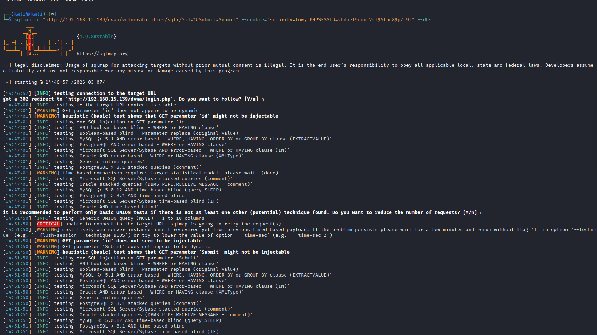
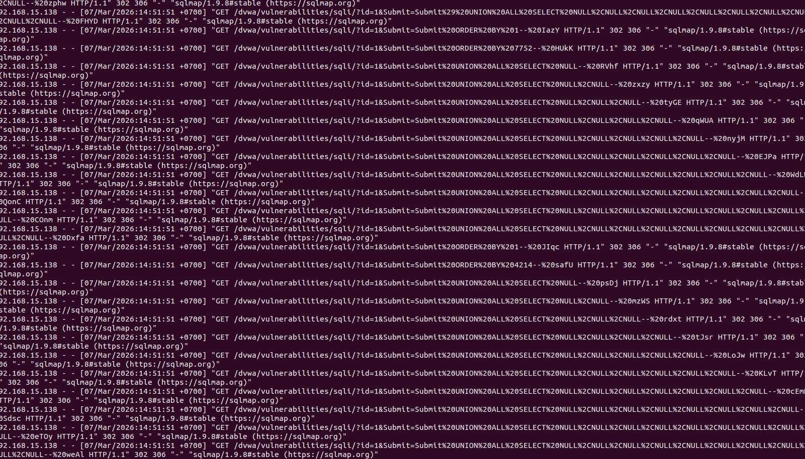
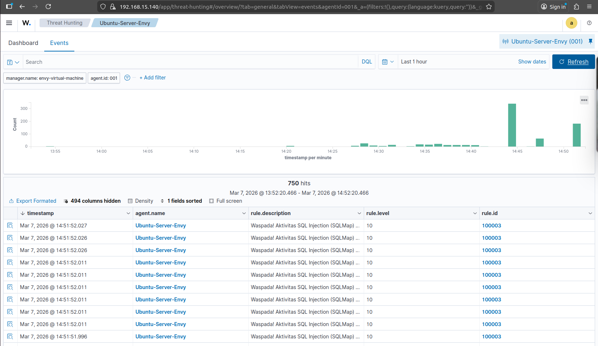

# 🛡️ Project #2: A05:2025 - Injection (SQL Injection SQLMap)

> **🔍 Catatan:** Project ini mendeteksi serangan **A05: Injection** dari OWASP Top 10 2025. Penomoran folder `02` adalah urutan project, bukan kode OWASP.

[](https://wazuh.com/)
[-red)](https://owasp.org/Top10/A03_2021-Injection/)
[-purple)](https://attack.mitre.org/techniques/T1190/)

## 📋 Ringkasan Proyek

Dokumentasi ini menunjukkan simulasi serangan **SQL Injection** menggunakan alat otomatis **SQLMap** dan bagaimana **Wazuh SIEM** mendeteksi aktivitas tersebut melalui analisis log Apache secara real-time. Skenario ini termasuk dalam kategori **A03: Injection** pada OWASP Top 10.

### Objektif Lab
- **Target Deteksi**: Percobaan eksploitasi database pada aplikasi web DVWA
- **Target Aplikasi**: DVWA (Damn Vulnerable Web Application) - Security Level: Low

## 🛠️ Arsitektur Lab

| Komponen | Sistem Operasi | IP Address | Peran |
|----------|----------------|------------|-------|
| **Attacker** | Kali Linux | `192.168.15.138` | Menjalankan serangan SQL Injection dengan SQLMap |
| **Target (Agent)** | Ubuntu Server 22.04 | `192.168.15.139` | Menjalankan Apache2 & DVWA, terpasang Wazuh Agent |
| **SIEM Manager** | Ubuntu 22.04 | `192.168.15.140` | Wazuh Manager (pusat analisis log) |

**Detail Target:**
- Aplikasi: **DVWA (Damn Vulnerable Web Application)** - Security Level: Low
- Web Server: **Apache2**
- Log yang dipantau: `/var/log/apache2/access.log`

## ⚔️ Simulasi Serangan (Step-by-Step)

### Langkah 1: Eksekusi SQLMap di Kali Linux

Serangan dilakukan dengan menyertakan **Cookie sesi (PHPSESSID)** agar SQLMap bisa melewati halaman login dan langsung menguji parameter `id` pada modul SQL Injection.

```bash
sqlmap -u "http://192.168.15.139/dvwa/vulnerabilities/sqli/?id=1&Submit=Submit" --cookie="security=low; PHPSESSID=vhdaet9nouc2sf95tpn89p7c9t" --dbs
```

**Penjelasan perintah:**
- `-u` → URL target yang akan diuji
- `--cookie` → Menyertakan session cookie untuk autentikasi
- `--dbs` → Meminta SQLMap untuk menampilkan daftar database yang tersedia

**Bukti Eksekusi Terminal:**



### Langkah 2: Analisis Payload di Log Apache

Pada sisi server, SQLMap mengirimkan ribuan permintaan dengan **payload berbahaya** untuk mengidentifikasi struktur database. Wazuh Agent menangkap **User-Agent** khas SQLMap pada setiap permintaan tersebut.

**Contoh payload yang terdeteksi di log:**
```
GET /dvwa/vulnerabilities/sqli/?id=1%20UNION%20ALL%20SELECT%20NULL%2CNULL%2CNULL%2CNULL%2CNULL%2CNULL%2CNULL%2CNULL%2CNULL--&Submit=Submit
```

**Tampilan Log Apache:**



## 🛡️ Strategi Deteksi (Wazuh Configuration)

### Custom Rule Implementation

Saya menerapkan *custom rule* pada Wazuh Manager untuk memantau log akses web secara spesifik terhadap identitas alat SQLMap.

> **📁 Lokasi file rule**: [`../rules/sqli_rules.xml`](../rules/sqli_rules.xml)

```xml
<rule id="100003" level="10">
  <if_sid>31100,31101,31108</if_sid>
  <regex type="pcre2">(?i)sqlmap</regex>
  <description>🚨 [A03: Injection] Aktivitas SQL Injection (SQLMap) Terdeteksi!</description>
  <mitre>
    <id>T1190</id>
  </mitre>
</rule>
```

### 🔍 Penjelasan Rule

| Komponen | Nilai | Keterangan |
|----------|-------|------------|
| **ID** | `100003` | ID unik untuk rule kustom (seri Injection) |
| **Level** | `10` | Tingkat keparahan sangat tinggi (alert kritis) |
| **if_sid** | `31100,31101,31108` | Hanya dievaluasi untuk event dari group web server |
| **regex** | `(?i)sqlmap` | Mencari string "sqlmap" (case-insensitive) di User-Agent |
| **mitre** | `T1190` | Mapping ke teknik Exploit Public-Facing Application |

## 📊 Hasil Analisis di Wazuh Dashboard

Wazuh berhasil memicu alert **Level 10** secara masif ketika serangan berlangsung, memberikan visibilitas penuh kepada SOC Analyst mengenai lonjakan aktivitas mencurigakan.

**Screenshot alert di Wazuh Dashboard:**



Detail alert yang muncul:

```
Rule ID    : 100003
Level      : 10
Description: 🚨 [A03: Injection] Aktivitas SQL Injection (SQLMap) Terdeteksi!
Source IP  : 192.168.15.138 (Attacker)
Target IP  : 192.168.15.139 (Target)
```

## 📊 Mapping MITRE ATT&CK

| Taktik | Teknik | ID |
|--------|--------|-----|
| Initial Access | Exploit Public-Facing Application | [T1190](https://attack.mitre.org/techniques/T1190/) |

## ✅ Kesimpulan

Proyek ini berhasil mendemonstrasikan:

1. **Deteksi Serangan Injection** - Wazuh mampu mengidentifikasi percobaan SQL Injection melalui analisis User-Agent khas SQLMap
2. **Visibility Real-time** - Alert Level 10 memberikan peringatan dini saat serangan berlangsung
3. **Forensik Log** - Payload SQL Injection terekam jelas di log Apache untuk analisis lebih lanjut
4. **Mapping MITRE ATT&CK** - Menghubungkan serangan dengan teknik T1190 untuk konteks ancaman yang lebih baik

## 📁 File Pendukung

- **Custom Rule**: [`../rules/sqli_rules.xml`](../rules/sqli_rules.xml) - File XML berisi rule deteksi SQLMap
- **Screenshots**: 
  - [`./images/sqlmap-attack.png`](./images/sqlmap-attack.png) - Eksekusi SQLMap di terminal
  - [`./images/apache-sqli-log.png`](./images/apache-sqli-log.png) - Log Apache dengan payload SQLi
  - [`./images/wazuh-sqli-alert.png`](./images/wazuh-sqli-alert.png) - Alert di Wazuh Dashboard

## 🖇️ Navigasi

- [**Kembali ke README Utama**](../README.md) - Lihat semua skenario OWASP Top 10
- [**Skenario Sebelumnya: A01 - Broken Authentication**](../01-Broken-Authentication/) - Deteksi Brute Force dengan Hydra

---
*Dokumentasi ini disusun sebagai bagian dari portofolio keamanan siber. Fokus: SIEM Engineering, Threat Detection, dan OWASP Top 10.*

---
